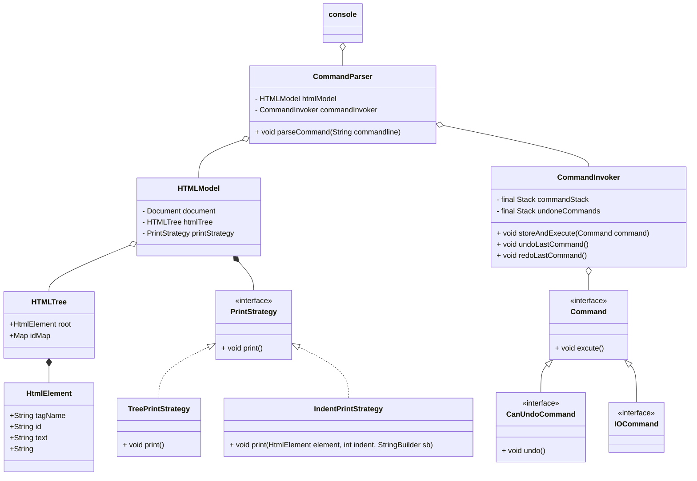

# Lab 1
## environment
jdk 19

依赖见 **pom.xml**
maven load 之后就可以直接运行
项目代码入口为**src/main/java/org/example/console/console.java**

## 结构
### 类图
* 总体结构上采用命令模式，分为 Command相关的模块和HtmlModel相关的模块
* 在Command模块中
  * Invoker通过命令的不同类型来进行不同的操作
  * 抽象为两级命令，便于区分具有不同特性的命令
    * CanUndoCommand：可撤销的命令
    * IOcommand：初始化模型或者保存模型的命令，会清空命令栈
    * Command：剩下的print和spellcheck未作归类
  * 不做任何IO操作，遇到问题，只是抛出异常，由顶层的console来处理，便于测试；
* 在Model模块中
  * 首先用一层HTMLModel来断开HTMLTree与解析第三方包的联系
  * 使用策略模式来实现print的不同方式
  * 在Model模块中，不做任何IO操作，对于print等指令，返回需要输出的String；遇到问题，只是抛出异常，由顶层的console来处理，便于测试；

## 自动化测试
主要针对 CommandParser ， CommandInvoker ， HTMLModel ，HTMLTree进行测试
**由于在各个模块中没有输入输出，这样使得我们的测试更加方便**

### CommandParser
**主要测试能否判断指令合法性和参数合法性，指令执行效果**

### CommandInvoker
**测试指令能否执行，redo，undo效果**

### HTMLTree
**测试各个修改model的函数是否有效**

### HTMLModel
**测试解析效果 读入保存 print即可**