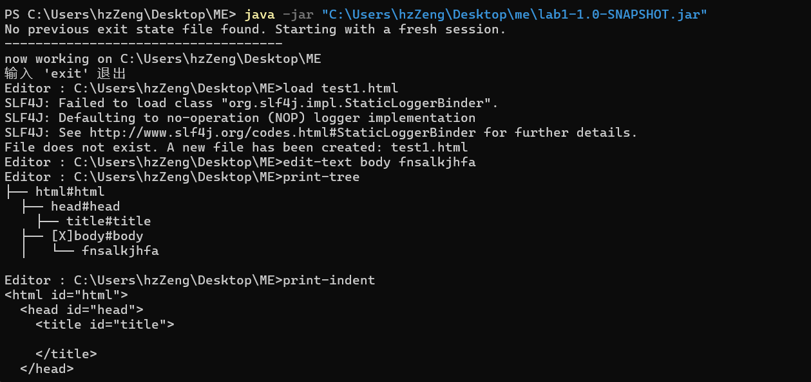
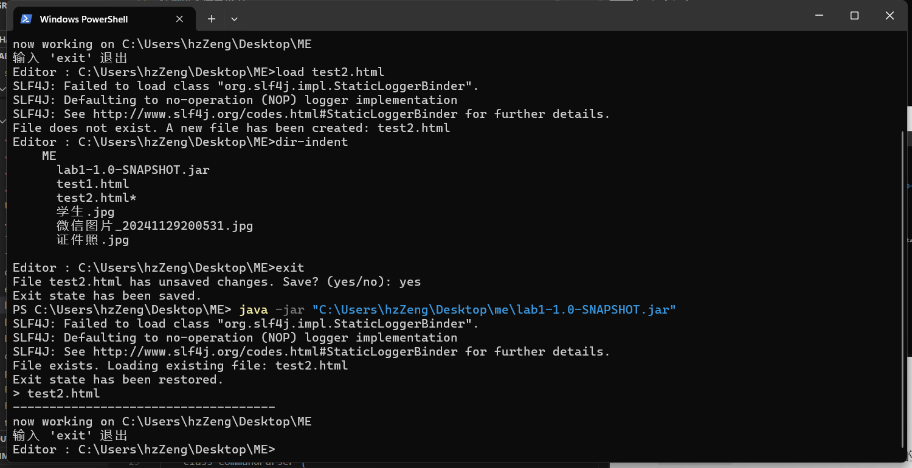
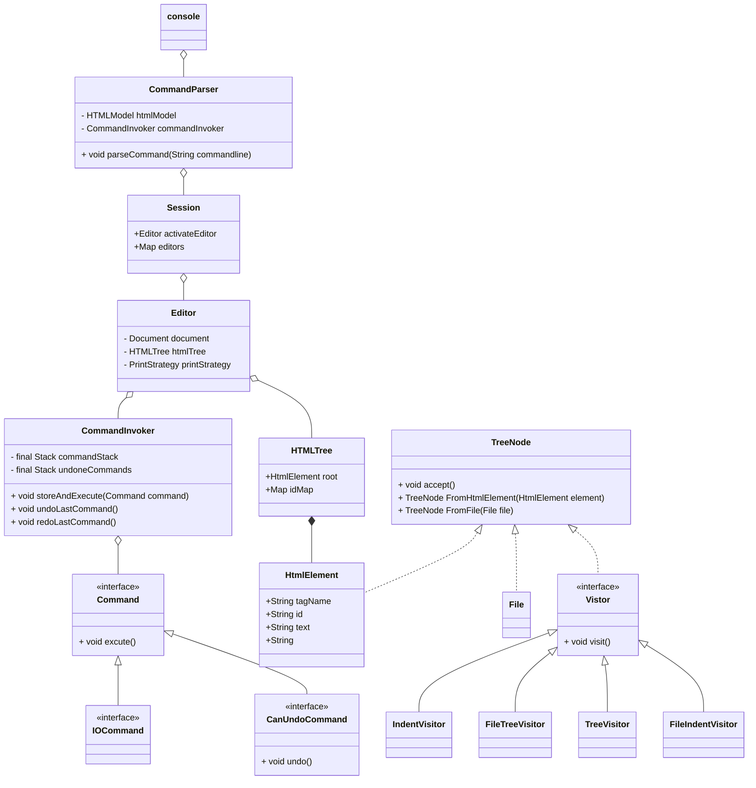

# Lab2
### java version 
java 19.0.2 2023-01-17
Java(TM) SE Runtime Environment (build 19.0.2+7-44)
Java HotSpot(TM) 64-Bit Server VM (build 19.0.2+7-44, mixed mode, sharing)
### 启动方法

在测试文件目录下
```bash
java -jar /path/to/lab1-1.0-SNAPSHOT-shaded.jar
```

在首次输入命令，由于Spellcheck的框架存在问题会报错三条，不影响实验正确性



之后就是正常测试即可
**重新加载样例**

### 架构
#### 包结构
* command ： 指令包
  * EditorCommand ： 与**编辑**有关的指令包
  * SeesionCommand ： 与**编辑器**有关的指令包
* console ： 控制器包，包含了Editor、Session、CommandPaser等控制器
* model ： 模型包，包含HtmlTree、TreeNode等模型
  * Visitor ： Visitor包，包含结构化输出的四个visitor
#### 类结构
总体采用**命令模式** ，具体框架见下方**类图**
* `CommandPaser`：只负责命令解析，不参与实际的操作
* `Session` : 工作台，包含多个Editor，负责处理切换Editor，输出Editorlist，目录输出，加载Editor等工作台级别的指令,由于这些指令并不需要Undo Redo，所以没有指令栈
* `Editor` ： 对单个文件的编辑器，负责操作单个文件，并且存储指令栈，可以Undo Redo
* `HtmlTree`：保持与Lab1 相同设计
* `TreeNode` ： **使用适配器模式**，便于将htmlelement结构和file的结构转化统一，便于输出操作
* `Visitor` ： **采用Visitor模式**，来解决不同的输出结构，但file的输出结构和html有较些许不同，对二者直接采取不同的visitor（总共四个），避免在代码中出现大量的判断语句
#### 类图




### 自动化测试
本次自动化测试**自顶向下**分为五个部分
* CommandParser
* Session
* Editor
* HTMLTree
* TreeNode（包括Visitor）
由于CommandInvoker已经检测
测试主要包括各个组件间的交互，以及各个组件的关键功能的正确性以验证代码的正确性，具体见下方测试用例
####    CommandParser
CommandParser只有基本的命令解析功能，所以测试主要在于指令是否能够正确地被解析即可，抛出异常即可，与上次没有太多差异


####    Session
 1. **文件加载（Handle Load）**：
   - **`testHandleLoadValidFile`**：确保加载一个有效文件后，`Session` 的 `activeEditor` 被正确设置，且文件被正确添加到 `editors` 映射中。
   - **`testHandleLoadDuplicateFile`**：测试加载相同文件两次时，抛出 `IllegalStateException` 异常，确保重复加载文件时不允许发生。

 2. **文件保存（Handle Save）**：
   - **`testHandleSaveWithActiveEditor`**：在有活动编辑器的情况下，测试保存文件的操作，确保保存后编辑器的 `modified` 状态被重置为 `false`。
   - **`testHandleSaveWithoutActiveEditor`**：测试没有活动编辑器时调用保存操作，确保抛出 `IllegalStateException` 异常。

  3. **文件退出（Handle Exit）**：
   - **`testHandleExitWithUnsavedChanges`**：模拟退出操作并处理有未保存更改的文件。虽然该测试代码中 `handleExit` 部分被注释掉，但此处旨在测试如何处理用户确认保存文件时的输入。

  4. **文件关闭（Handle Close）**：
   - **`testHandleCloseWithUnmodifiedFile`**：测试关闭未修改的文件，确保 `activeEditor` 被正确清空，且文件从 `editors` 映射中删除。
   - **`testHandleCloseWithModifiedFile`**：测试关闭已修改文件时，模拟用户保存文件的输入，确保文件保存后被关闭，`activeEditor` 被清空，且文件从 `editors` 映射中删除。

  5. **编辑器列表（Handle Editor List）**：
   - **`testHandleEditorList`**：测试打印编辑器列表的功能，验证是否能正确显示活动编辑器和其他加载的文件。确保活动编辑器的文件名旁边有修改标记。

  6. **恢复退出状态（Restore Exit State）**：
   - **`testRestoreExitState`**：测试保存和恢复 `Session` 状态的功能。确保在恢复后，`editors` 的大小和活动编辑器的状态与保存的状态一致。

  7. **查找已修改的编辑器（Find Modified Editors）**：
   - **`testFindModifiedEditors`**：测试查找已修改的编辑器，确保能正确识别哪些文件已被修改。

### 总结：


####    Editor
1. **HTML Parsing**:
   - **`testHTMLModel_ParsesHTMLCorrectly`**：测试 `Editor` 能正确解析有效的 HTML 内容。
   - **`testHTMLModel_EmptyHTML`**：测试空 HTML 文档解析，确保返回正确的内容（空字符串）。
   - **`testHTMLModel_NullHTML`**：测试设置为 `null` 的文档，确保返回 `null`。

2. **Text Editing**:
   - **`testEditTextValidId`**：测试修改存在的元素的文本内容是否生效。
   - **`testEditTextInvalidId`**：测试修改不存在元素时，是否抛出 `IllegalArgumentException`。

3. **Editor Commands**:
   - **`testHandleInsert`**：测试 `insert` 命令，确保插入元素后，元素内容正确。
   - **`testHandleEditText`**：测试 `editText` 命令，修改元素的文本内容并验证修改结果。
   - **`testHandleEditId`**：测试 `editId` 命令，修改元素 ID 并验证修改后的 ID 是否正确。
   - **`testHandleDelete`**：测试 `delete` 命令，确保删除元素后无法再找到该元素。
   - **`testHandleAppend`**：测试 `append` 命令，将子元素追加到父元素下，并验证子元素是否正确追加。

4. **Printing & Output**:
   - **`testHandlePrintTree`**：测试打印元素树结构，确保打印输出包含插入的内容。

5. **Undo/Redo Operations**:
   - **`testHandleUndoRedo`**：测试撤销和重做操作，确保撤销操作能移除元素，重做操作能恢复元素。
   - **`testUndoRedoCommands`**：测试撤销和重做操作，并验证元素的存在性和内容是否正确。

6. **File Saving**:
   - **`testSaveToPath`**：测试将编辑器内容保存到指定路径，确保内容正确保存到文件中。


####    HTMLTree
* 主要测试功能是对html的修改，所以主要测试的是这些功能是否能够正确地执行，并且能够正确地输出，和上次lab保持一致故而不做过多解释


####    TreeNode Visitor
* 测试适配器是否能够转换
* 测试Visitor在不同情况下的输出
  * `FileVistor` 测试类包含以下测试：

    1. **`testFileTreeVisitor`**：验证文件树遍历输出是否正确，检查修改文件（如 `file1.txt*`）和目录结构。

    2. **`testFileTreeVisitorEmptyDir`**：测试空目录，确保正确输出目录名称且没有修改标记。

    3. **`testModifiedFileTree`**：验证修改的文件是否正确标记（如 `file1.txt*` 和 `file2.txt*`）。

    这些测试确保文件树结构正确、修改文件标记正确，并且输出格式符合预期。
  * `HtmlVisitorTest` 包含以下测试：

    1. **`testSimpleHtml`**：验证简单 HTML 文档的标签和内容是否正确输出。
    2. **`testNestedElements`**：测试嵌套的 HTML 元素，确保多层结构的解析无误。
    3. **`testEmptyTags`**：检查空标签（没有内容的标签）是否被正确处理。
    4. **`testAttributesHandling`**：验证带有属性的 HTML 标签是否正确解析，属性是否显示。
    5. **`testAttributesShow`**：检查是否能够展示标签属性。
    6. **`testDeepNestedTags`**：测试深度嵌套的 HTML 标签，确保解析层级结构正确。
    7. **`testMixedContent`**：验证混合内容（文本和 HTML 标签）是否正确处理。
    8. **`testIndentedHtml`**：测试带有缩进的 HTML 文档，确保正确处理缩进格式。

    这些测试方法确保了对各种 HTML 结构（包括属性、空标签、嵌套和缩进等）的正确解析和遍历。


