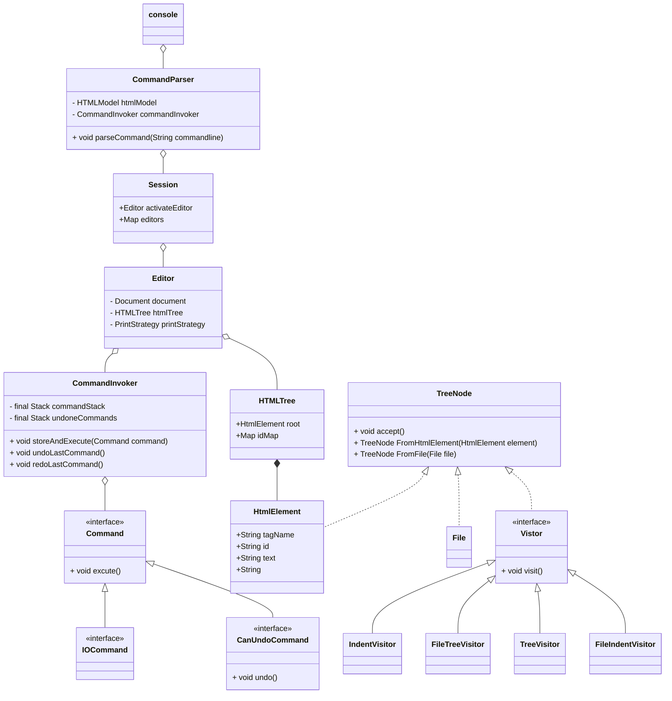

# Lab2
### java version 
java 19.0.2 2023-01-17
Java(TM) SE Runtime Environment (build 19.0.2+7-44)
Java HotSpot(TM) 64-Bit Server VM (build 19.0.2+7-44, mixed mode, sharing)
### 启动方法

在测试文件目录下
```bash
java -jar /path/to/lab1-1.0-SNAPSHOT-shaded.jar
```

在首次输入命令，由于Spellcheck的框架存在问题会报错三条，不影响实验正确性


之后就是正常测试即可
**重新加载样例**

### 架构
#### 包结构
* command ： 指令包
  * EditorCommand ： 与**编辑**有关的指令包
  * SeesionCommand ： 与**编辑器**有关的指令包
* console ： 控制器包，包含了Editor、Session、CommandPaser等控制器
* model ： 模型包，包含HtmlTree、TreeNode等模型
  * Visitor ： Visitor包，包含结构化输出的四个visitor
#### 类结构
总体采用**命令模式** ，具体框架见下方**类图**
* `CommandPaser`：只负责命令解析，不参与实际的操作
* `Session` : 工作台，包含多个Editor，负责处理切换Editor，输出Editorlist，目录输出，加载Editor等工作台级别的指令,由于这些指令并不需要Undo Redo，所以没有指令栈
* `Editor` ： 对单个文件的编辑器，负责操作单个文件，并且存储指令栈，可以Undo Redo
* `HtmlTree`：保持与Lab1 相同设计
* `TreeNode` ： **使用适配器模式**，便于将htmlelement结构和file的结构转化统一，便于输出操作
* `Visitor` ： **采用Visitor模式**，来解决不同的输出结构，但file的输出结构和html有较些许不同，对二者直接采取不同的visitor（总共四个），避免在代码中出现大量的判断语句
#### 类图




### 自动化测试
本次自动化测试**自顶向下**分为五个部分
* CommandParser
* Session
* Editor
* HTMLTree
* TreeNode（包括Visitor）
由于CommandInvoker已经检测
测试主要包括各个组件间的交互，以及各个组件的关键功能的正确性以验证代码的正确性，具体见下方测试用例
####    CommandParser


####    Session


####    Editor


####    HTMLTree


####    TreeNode


